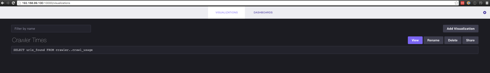

# go-crawler

A web crawler that will can be specified to crawler certain websites based on a regex and to a specified depth.
It then will take the valid url that it has visited and put that url into a host-sharded Redis queue.

Example:

<http://www.cnn.com/world> -> www.cnn.com_crawler_queue

<http://www.youtube.com/watch?v=92hvkm39cn3> -> www.youtube.com_crawler_queue

# Use Case

The main goal of this program is so that we can specify certain seed urls, and regexes so that it will
only crawl those websites based on the regex specified. Once the crawlers have finished crawling to the
specified depth or have exhausted traversing the web graph all this information can then be used by an
indexing application since all of the websites pertaining to a certain host are stored in their respective
redis queues.

# Setup

To locally setup the crawler all you need to do is run the `bootstrap.sh` script. This will ensure that Go is
install and that your `$GOPATH` is setup, get all project dependencies, and build the binary.

```
$ ./bootstrap.sh
```

## Docker

You can either pull the docker image from [Docker Hub](https://hub.docker.com)

```
$ docker pull cpurta/go-crawler:latest
```

# Usage

## Locally

You can either run the program locally in your terminal, with the caveat that you have to specify environment
variables in your current shell session to the Redis server.

Redis Environment variables require by go-crawler

|    env variable name      |    env variable value |
| ------------------------- | --------------------- |
| REDIS_PORT_6379_TCP_ADDR  |   Redis host          |
| REDIS_PORT_6379_TCP_PORT  |   Redis port (6379)   |

```
$ export REDIS_PORT_6379_TCP_ADDR=127.0.0.1
$ export REDIS_PORT_6379_TCP_PORT=6379
```

After you have exported these environment variables you can now run the go-crawler

Example run

```
$ ./crawler -depth 5 -seed-url http://www.cnn.com -search '^.*www\.cnn\.com.*$'
```

This example will start crawling the page www.cnn.com and crawl all urls found on that page that have the domain of www.cnn.com

## Docker

Since we have the Docker image you can specify the environment variables above as a part of running the docker container.

```
$ docker run -it --rm --name crawler -e REDIS_PORT_6379_TCP_ADDR=127.0.0.1 -e REDIS_PORT_6379_TCP_PORT=6379 cpurta/go-crawler:latest
```

## Docker-compose

We can also use docker-compose to then link our go-crawler container to a running instance of redis since we have specified
this in the `docker-compose.yml` file. This is simple as running a simple docker-compose command.

```
$ docker-compose build
    ...
$ docker-compose run crawler crawler -seed-url http://www.google.com -depth 10
```

If you are having any issues running the program or are not sure what is require just run the program using the `--help` flag.


# Monitoring

With docker-compose you can now run an instance of InfluxDB and Chronograf to monitor some interesting metrics of go-crawler.
If you are unfamiliar with [InfluxDB](https://influxdata.com/) or [Chronograf](https://influxdata.com/time-series-platform/chronograf/)
I highly recommend that you go and check them out as they are awesome open source tools for monitoring and querying realtime data
gathered by you applications.

## Starting it all up

Thanks to docker-compose this is as simple as running `docker-compose up` as in the `docker-compose.yml` file we have specified all
images needed and linked all services needed.

```
$ docker-compose build && docker-compose up
```

Once we have everything up and running we can look at the metrics of the program in Chronograf in our browser. Since dockers machine
ip by default is `192.168.99.100` we can use that to access the running Chronograf container. NOTE: If you have this running on another
docker machine other than `default` you will have to get the ip of the machine running all the programs by using the
`docker-machine ip [machine]`.

### Dashboards

You should then see the Chronograf UI which you can then register the locally running instance of InfluxDB and create Dashboards
and query data however you see fit.


